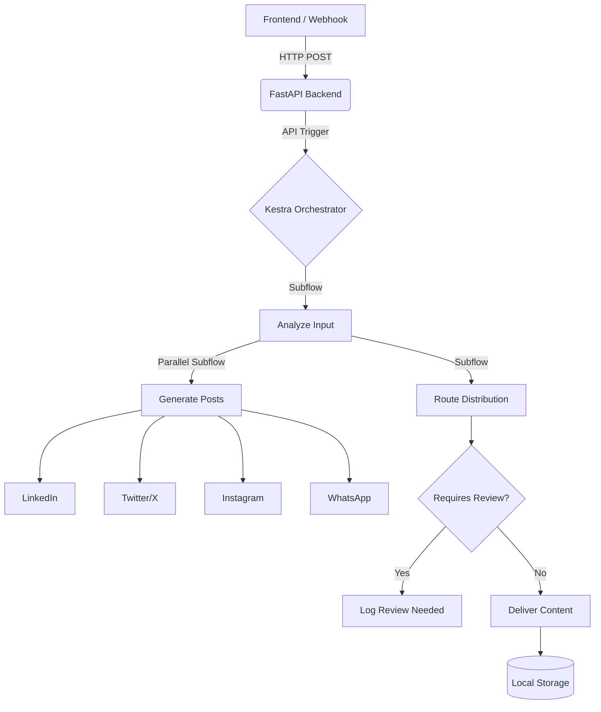

# AutoPR Engine 🚀

**AI Content Orchestration & Distribution System**

AutoPR Engine is an advanced orchestration system built on top of **Kestra** that takes raw inputs (e.g., GitHub commits, project notes, or manual inputs), intelligently analyzes them using AI (or a deterministic fallback), generates platform-specific content (LinkedIn, Twitter/X, Instagram, WhatsApp), and routes them automatically to the right channels.

## 🌟 Pitch
Developers hate writing release notes and social media updates. AutoPR Engine automates this entirely. By throwing a single raw update into the system, Kestra orchestrates a complex workflow of analysis, parallel generation, intelligent routing, and delivery.

## 🏗 Architecture
The system consists of:
- **Kestra Orchestrator**: The brain running the workflow DAG.
- **FastAPI Backend**: API gateway that triggers Kestra flows.
- **React + Vite Frontend**: A modern dashboard to monitor executions and submit updates.
- **Python Tasks**: Data processing tasks running directly within Kestra.



## 🚀 Setup & Execution

### 1. Start the System
Ensure you have Docker and Docker Compose installed.
```bash
docker compose up -d
```
This will start:
- Kestra UI: http://localhost:8080
- FastAPI Backend: http://localhost:8000
- React Dashboard: http://localhost:3000

### 2. Load the Flows
If the flows are not automatically loaded into Kestra, you can upload the files from the `flows/` directory into Kestra's UI, or push them via the API.
Wait, since we mounted the files, we can also manually upload them in the Kestra UI under `Flows > Add`.

### 3. Demo Data
See `DEMO_SCRIPT.md` for a sample payload.

### 4. Real Credentials
See `CREDENTIALS.md` for GitHub token setup and the live delivery adapter credentials needed for LinkedIn, X, Instagram, and WhatsApp.

## 💡 Why Kestra?
Kestra is used here because it excels at:
- Handling complex subflows and nested logic.
- Executing python scripts safely using robust runners.
- Parallel processing (generating 4 platform posts at once).
- Conditional branching (Routing based on analysis).
- Total observability through the topology UI and execution logs.
